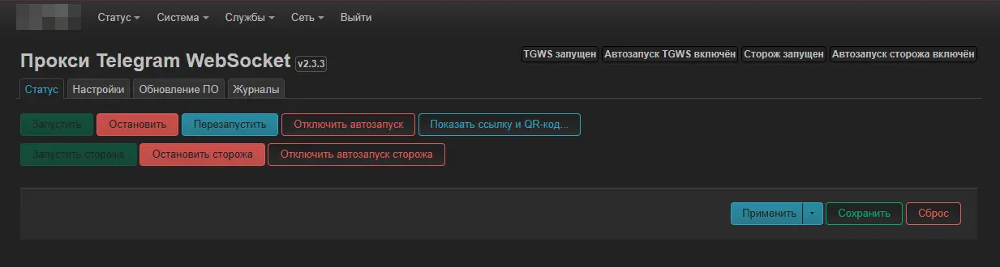
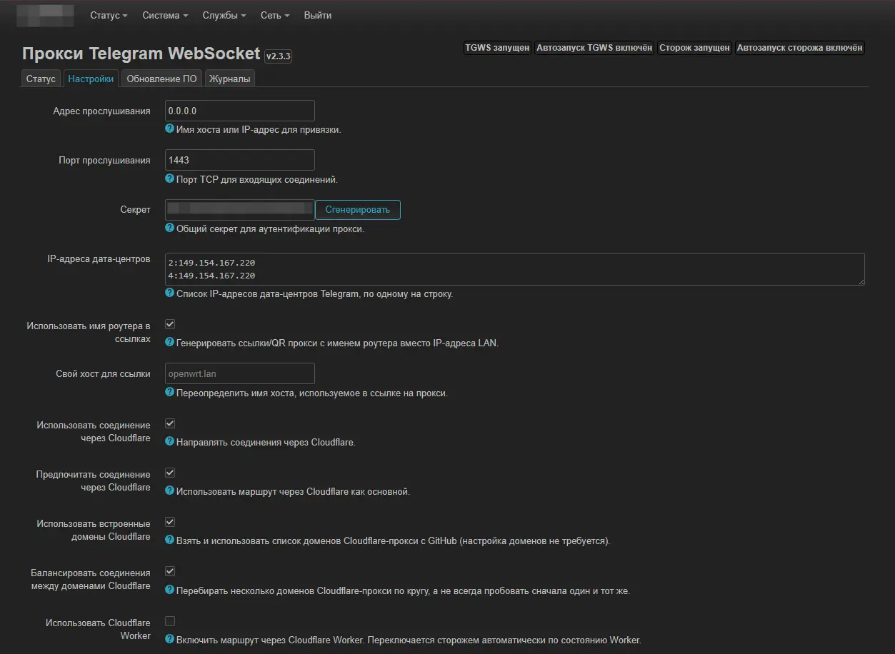
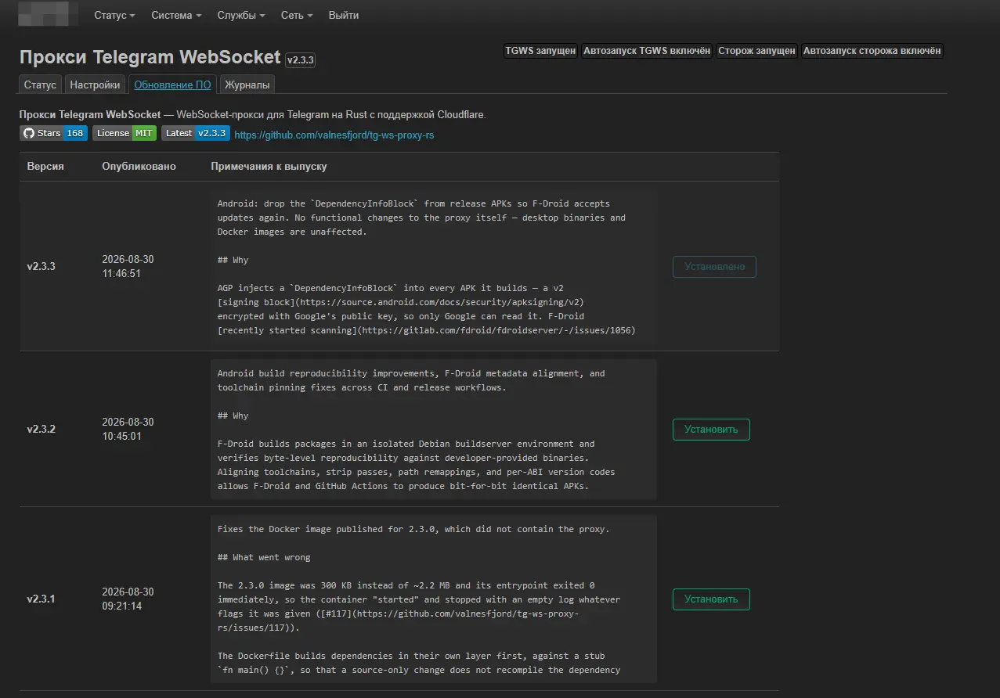
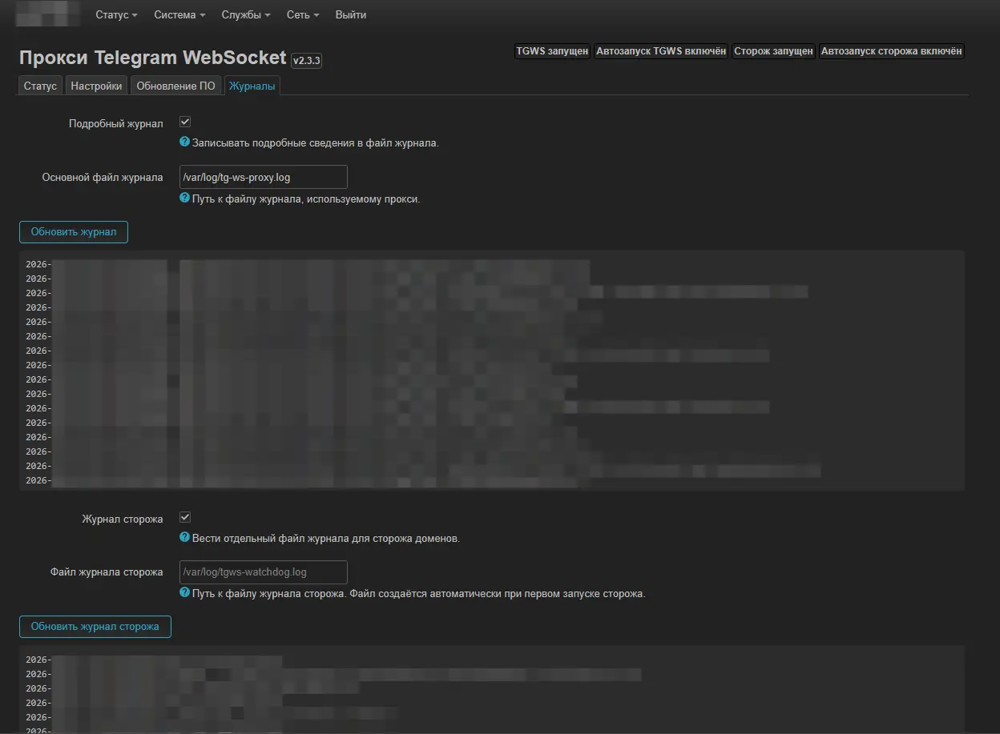

# luci-app-tgws-rs

> **Русский:** [README на русском](README.md)

LuCI web interface for **[tg-ws-proxy-rs](https://github.com/valnesfjord/tg-ws-proxy-rs)** — a Telegram WebSocket proxy written in Rust.

The UI lets you manage the proxy right from the router web panel: status, settings (including Cloudflare / worker mode), software updates straight from the GitHub releases, logs and an automatic Cloudflare-domain watchdog.



## Features

- **Status tab** — service running state, current version, quick Start / Stop / Restart / auto-start toggle
- **Settings** — host, port, secret (auto-generated with QR + `tg://proxy` link), connection link, DC IP overrides, buffer/pool tuning
- **Cloudflare mode** — custom proxy domain, built-in domain list, worker domain with automatic health toggle, connection balancing
- **Software Update** — checks the upstream GitHub repository and installs new releases directly to the router (**Rust binary is fetched separately**, see below), with version rollback
- **Logs** — live service log with time stamping, verbosity switch, watchdog log
- **Watchdog** — probes Cloudflare domains via cron, keeps only healthy ones, auto-restarts the service on regressions
- **Russian translation** included

## Requirements

- OpenWrt **25.x** (apk) or **24.x / 23.x** (opkg) — LuCI web interface
- **[tg-ws-proxy-rs](https://github.com/valnesfjord/tg-ws-proxy-rs)** binary installed at `/usr/bin/tg-ws-proxy`

The LuCI package **does not include** the proxy binary itself — it is arch-specific
(mipsel / aarch64 / x86_64 / …) and is delivered by the upstream project.
Install it separately either from a prebuilt release or a built-from-source binary.

## Installation

### OpenWrt 25.x (apk)

Download the latest `.apk` from the [Releases page](../../releases) and run:

```sh
apk add --allow-untrusted ./luci-app-tgws-rs_1.0.0_1_all.apk
```

To also get the Russian localization, install the matching `luci-i18n-tgws-rs-ru` package (built alongside the main .apk).

### OpenWrt 24.x and older (opkg)

```sh
opkg install ./luci-app-tgws-rs_1.0.0-r1_all.ipk
opkg install ./luci-i18n-tgws-rs-ru_1.0.0-r1_all.ipk   # optional
```

After installation the **TG WS Proxy** entry appears under *LuCI → Services*.
Generate a secret (or import your existing one) in the Settings tab and enable the service.

## Screenshots






## Building from source

The packages are built automatically by GitHub Actions ([`.github/workflows/build.yml`](.github/workflows/build.yml))
on every `v*` tag — both OpenWrt 25 `.apk` and 23/24 `.ipk` are published to the
[Releases page](../../releases).

To build manually with the OpenWrt SDK:

```sh
# 1. clone the luci feed, place this package under package/luci-app-tgws-rs
# 2. in the SDK / buildroot:
./scripts/feeds install luci-app-tgws-rs
echo "CONFIG_PACKAGE_luci-app-tgws-rs=y" > .config
make defconfig
make package/luci-app-tgws-rs/compile
```

The package is arch-independent (`PKGARCH:=all`) — one file works for every router architecture.

## License

Apache-2.0 — see [LICENSE](LICENSE).